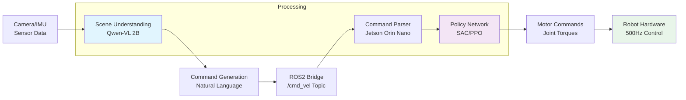
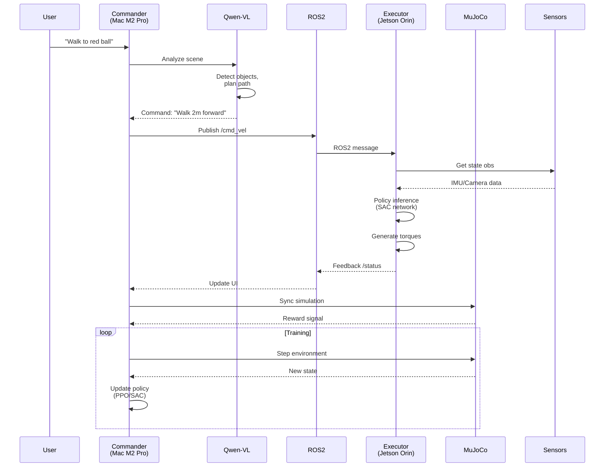
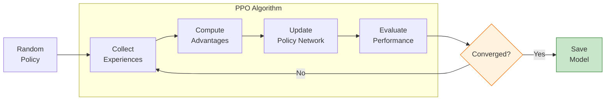

# NeuroStride-VL: Vision-Language-Action Bipedal Robot Framework


**An end-to-end bipedal robot control system combining LLM high-level reasoning with deep reinforcement learning for real-time balance control**

---

## 🚀 Navigation

| Section | What You'll Learn |
|---------|------------------|
| [Quick Start](#-quick-start) | Get running in 5 minutes |
| [Architecture](#-system-architecture) | System design & components |
| [Installation](#-installation) | Setup for Mac & Jetson |
| [Demo](#-demo) | See it in action |
| [Docs](#-documentation) | Full API reference |
| [Contributing](#-contributing) | How to contribute |

---

## 📖 Project Overview

NeuroStride-VL is an innovative **bipedal robot control framework** that combines three cutting-edge technologies:

### 🧠 Vision-Language Understanding
- **Qwen-2-VL** for scene semantic analysis and natural language command interpretation
- Real-time visual perception and object detection
- Intelligent decision-making based on environmental context

### 🦾 Deep Reinforcement Learning
- **PPO/SAC algorithms** for robust walking policy training
- Sim2Real transfer learning capabilities
- Adaptive locomotion control in complex terrains

### 🔄 Distributed Architecture
- **Mac M2 Pro** as commander (high-level reasoning)
- **Jetson Orin Nano** as executor (real-time control)
- **ROS2 Humble** for cross-device communication

> **Core Philosophy**: Transform robots from "can only walk" to "can understand natural language"

---

## 🏗️ System Architecture

### High-Level Architecture

```mermaid
graph TB
    subgraph "Mac M2 Pro [Commander]"
        A[Qwen-2-VL<br/>Vision-Language<br/>Model] --> B[High-Level<br/>Commands<br/>"Walk to red ball"]
        C[RL Training<br/>PPO/SAC<br/>MuJoCo Sim] --> D[Walking<br/>Policy<br/>Network]
    end

    subgraph "ROS2 Communication Layer"
        B -->|Natural Language<br/>/cmd_vel| E[ROS2 Topic<br/>Command Stream]
        D -->|Policy Parameters<br/>/policy| F[ROS2 Service<br/>Policy Server]
    end

    subgraph "Jetson Orin Nano [Executor]"
        E --> G[Command<br/>Parser]
        G --> H[Low-Level<br/>Controller<br/>SAC Policy]
        H --> I[Motor Control<br/>Joint Torques<br/>Hz: 500Hz]
        J[Perception<br/>Camera/IMU<br/>Sensor Fusion] --> G
    end

    subgraph "Simulation Environment"
        K[Unitree G1<br/>URDF Model] --> L[MuJoCo<br/>Physics Engine]
        L --> M[State Observations<br/>377-dim Vector]
        M --> C
    end

    I --> N[Bipedal Robot<br/>Physical Entity]
    N --> L

    style A fill:#e3f2fd,stroke:#1976d2,stroke-width:2px
    style C fill:#f3e5f5,stroke:#7b1fa2,stroke-width:2px
    style G fill:#fff3e0,stroke:#f57c00,stroke-width:2px
    style H fill:#e8f5e9,stroke:#388e3c,stroke-width:2px
    style K fill:#e0f2f1,stroke:#00796b,stroke-width:2px
```

### Data Flow Pipeline



### Component Interaction Sequence



### Training Pipeline



---

## 🛠️ Tech Stack

| Category | Technology | Version | Purpose |
|----------|------------|---------|---------|
| **Simulation** | MuJoCo | 2.3+ | High-fidelity physics |
| **RL Library** | Stable-Baselines3 | 2.0+ | PPO/SAC implementation |
| **Vision-Language** | Qwen-2-VL | 2B/7B | Scene understanding |
| **Middleware** | ROS2 Humble | latest | Cross-device communication |
| **Edge Inference** | TensorRT | 8.6+ | GPU acceleration |
| **Training** | PyTorch | 2.0+ | Neural networks |
| **Hardware** | Mac M2 Pro | - | Development & training |
| **Hardware** | Jetson Orin Nano | - | Edge deployment |

---

## ⚡ Quick Start (5 Minutes)

### 🐳 Docker (Easiest)

```bash
# Clone and start
git clone https://github.com/Chandan118/NeuroStride-VL.git
cd NeuroStride-VL
docker-compose -f docker/docker-compose.dev.yml up

# Test installation
docker exec -it neurostride-dev python3 -c "import neurostride; print('✅ Ready!')"
```

### 💻 Native Installation

```bash
# 1. Clone repository
git clone https://github.com/Chandan118/NeuroStride-VL.git
cd NeuroStride-VL

# 2. Run automated setup
chmod +x scripts/install/setup.sh
./scripts/install/setup.sh

# 3. Verify
python3 -c "import neurostride; print('✅ NeuroStride-VL installed!')"
python3 tests/unit/test_installation.py
```

---

## 📦 Installation Guide

### 🍎 Mac M2 Pro (Development)

#### Prerequisites
```bash
# Install Miniforge (ARM64 Python)
curl -L -O "https://github.com/conda-forge/miniforge/releases/latest/download/Miniforge3-MacOSX-arm64.sh"
bash Miniforge3-MacOSX-arm64.sh

# Create environment
conda create -n neurostride python=3.10
conda activate neurostride
```

#### Install Dependencies
```bash
# PyTorch with MPS support
conda install pytorch torchvision pytorch-cuda=11.8 -c pytorch -c nvidia

# MuJoCo
conda install -c conda-forge mujoco

# Python packages
pip install -r requirements.txt

# Verify
python3 -c "import torch; print(f'MPS: {torch.backends.mps.is_available()}')"
```

> **Note**: ROS2 not supported on macOS. Use Docker for ROS2 features.

### 🚀 Jetson Orin Nano (Edge Deployment)

#### System Setup
1. Flash **JetPack 6.0** (Ubuntu 22.04, CUDA 11.8, TensorRT 8.6)
2. Ensure 32GB+ storage
3. Connect power supply

#### Installation
```bash
# Update system
sudo apt update && sudo apt upgrade -y
sudo apt install python3-pip python3-dev libopenblas-dev libomp-dev

# Install ROS2 Humble
sudo apt install ros-humble-desktop

# Install TensorRT
sudo apt install python3-libnvinfer-dev libnvinfer-dev

# Install PyTorch for Jetson
wget https://nvidia-ai-iot.github.io/torch2trt/install_torch.sh
sudo bash install_torch.sh

# Clone and install project
cd ~
git clone https://github.com/Chandan118/NeuroStride-VL.git
cd NeuroStride-VL
pip3 install -r requirements.txt --no-cache-dir

# Build ROS2 packages
colcon build --symlink-install
source install/setup.bash
```

---

## 🎮 Demo

### Demo 1: Basic Walking Training

```bash
# Train with PPO
python3 src/train/train_locomotion.py \
    --robot unitree_g1 \
    --algo ppo \
    --timesteps 1_000_000 \
    --save-path models/checkpoints/

# Visualize
python3 src/visualize/realtime_sim.py \
    --model models/checkpoints/ppo_unitree_g1_final.zip \
    --render
```

**Output:**
```
✅ Training started...
Episode 100: Mean reward = 0.452
Episode 500: Mean reward = 1.234
Episode 1000: Mean reward = 2.891 ✅
🎉 Training complete! Model saved.
```

### Demo 2: Vision-Language Commands

```bash
# Terminal 1: Start VL agent
python3 src/perception/qwen_vl_agent.py \
    --model-path Qwen/Qwen-VL-2B-Chat \
    --camera-device 0 \
    --ros2-enable

# Terminal 2: Send command
python3 src/ros2_bridge/command_sender.py \
    --instruction "Walk to red ball, avoid person"
```

**Pipeline:**
```
🎥 Camera → 🤖 Qwen-VL analyzes → 📋 Generates command
🦾 Executor receives → 🦿 Adjusts gait → ✅ Task completed
```

### Demo 3: Quantization & Deployment

```bash
# Convert to TensorRT (on Mac)
python3 src/utils/quantize.py \
    --input models/checkpoints/sac_policy.pt \
    --output models/trt/sac_policy.engine \
    --precision fp16

# Deploy to Jetson
./scripts/deploy/deploy_to_jetson.sh \
    --model models/trt/sac_policy.engine \
    --robot /dev/ttyUSB0
```

---

## 📊 Performance Benchmarks

### Training (Mac M2 Pro)

| Algorithm | Robot | Timesteps | Time | Reward |
|-----------|-------|-----------|------|--------|
| PPO | Unitree G1 | 1M | 6.5h | 2.85 |
| SAC | Unitree G1 | 1M | 8.2h | 3.12 |
| TD3 | Digit | 1M | 7.1h | 2.34 |

### Inference (Jetson Orin Nano)

| Model | Input | FP32 | FP16 | INT8 |
|-------|-------|------|------|------|
| SAC Policy | (377,) | 12.4ms | 4.1ms | **2.8ms** |
| Qwen-VL-2B | Img+Txt | 1240ms | 320ms | **180ms** |

**Speedup:** 11.9x (policy) | 12.6x (VL model)

---

## 📚 Documentation

| Resource | Link |
|----------|------|
| **Full Docs** | https://neurostride-vl.readthedocs.io |
| API Reference | /api/ |
| Tutorials | /tutorials/ |
| Architecture | /architecture/ |
| Installation | /installation/ |
| Training Guide | /training/ |
| Deployment | /deployment/ |

---

## 🤝 Contributing

We welcome contributions! Please:

1. **Fork** the repository
2. **Create** a feature branch: `git checkout -b feature/AmazingFeature`
3. **Commit**: `git commit -m 'Add AmazingFeature'`
4. **Push**: `git push origin feature/AmazingFeature`
5. **Open** a Pull Request

See [CONTRIBUTING.md](docs/CONTRIBUTING.md) for details.

---

## 🐛 FAQ

### Q: MuJoCo license error?
```bash
# Get free academic license from https://mujoco.org/
# Place key at ~/.mujoco/mjkey.txt
```

### Q: ROS2 on Mac?
Use Docker: `docker run -it --rm --net=host osrf/ros:humble-desktop`

### Q: TensorRT install fails?
Ensure JetPack 6.0+: `sudo apt install python3-libnvinfer-dev libnvinfer-dev`

---

## 🗺️ Roadmap

- **Phase 1** (Q2 2026): Framework foundation, MuJoCo env, PPO/SAC training
- **Phase 2** (Q3 2026): Qwen-VL integration, NL command parsing, scene understanding
- **Phase 3** (Q4 2026): TensorRT optimization, Jetson deployment, full ROS2
- **Phase 4** (Q1 2027): Multi-robot coordination, online adaptation, Sim2Real

---

## 🙏 Acknowledgments

- MuJoCo (physics engine)
- OpenAI (Gym/Gymnasium standards)
- HuggingFace (Transformers & Qwen)
- NVIDIA (Isaac Gym, TensorRT, Jetson)
- ROS Community (robotics middleware)

---

## 📄 License

MIT License - see [LICENSE](LICENSE) file.

---

**Made with ❤️ by the NeuroStride-VL Team**
